# 🚀 **LastLink Payment – Anticipation Service**

### **Clean Architecture • .NET 8.0.416 • Angular 17.3.8 • SQLite • EF Core 8**

---

# ⚡ **Executive Summary (For Evaluators)**

A concise overview for rapid evaluation.

### **Technology**

* Backend: **.NET 8.0.416**, EF Core 8 (SQLite), Clean Architecture
* Frontend: **Angular 17.3.8**, TypeScript
* Testing: **NUnit + FluentAssertions + Moq**, Postman E2E
* Architecture: **DDD + Application Layer + Isolation through Interfaces**

### **Business Capabilities (V1)**

* Create anticipation
* Enforce business rules (min value, pending restriction)
* Approve / Reject
* List by creator
* Simulation endpoint
* Full unit + E2E testing suite

### **Roadmap**

* **V2:** Docker + Failover + Retry
* **V3:** JWT + Logging + Observability + Circuit Breaker
* **POC:** Event-driven with Redis Streams

---

# ⚙️ **1. Quick Start (Backend + Frontend)**

### **Backend — start in < 30 seconds**

```bash
cd LastLink.Payment.Anticipation
dotnet restore
dotnet ef database update \
  --project backend/src/LastLink.Payment.Anticipation.Infrastructure \
  --startup-project backend/src/LastLink.Payment.Anticipation.Api

cd backend/src/LastLink.Payment.Anticipation.Api
dotnet run --launch-profile "LastLink.Api.Local(HTTP)"
```

API:

```
http://localhost:5274/api/v1/anticipations
```

Swagger:

```
http://localhost:5274/swagger
```

---

### **Frontend — start in < 20 seconds**

```bash
cd LastLink.Payment.Anticipation/frontend/lastlink-payment-front
npm install
ng serve --open
```

UI:

```
http://localhost:4200/
```

---

# 📁 **2. Essential Project Structure (ASCII)**

```text
LastLink.Payment.Anticipation
├── backend/
│   ├── src/
│   │   ├── LastLink.Payment.Anticipation.Api/              (Controllers, filters, DI setup)
│   │   ├── LastLink.Payment.Anticipation.Application/      (Services, DTOs, interfaces)
│   │   ├── LastLink.Payment.Anticipation.Domain/           (Entities, rules, exceptions)
│   │   └── LastLink.Payment.Anticipation.Infrastructure/   (DbContext, EF configs, repositories)
│   │
│   └── tests/
│       └── LastLink.Payment.Anticipation.Tests/            (NUnit + Moq + FluentAssertions)
│
├── frontend/
│   └── lastlink-payment-front/
│       └── src/
│           ├── app/
│           │   ├── features/
│           │   │   └── anticipation/
│           │   │       ├── create/
│           │   │       └── list/
│           │   ├── layout/
│           │   └── shared/
│           │
│           ├── assets/
│           └── environments/
│
├── docs/                                                   (Architecture diagrams, documentation)
├── e2e/
│   └── postman/                                            (Complete E2E suite with traceability)
│
└── global.json                                             (.NET SDK pin = 8.0.416)

```

---

# 📘 **Detailed Content (Full Documentation Begins Here)**

➤ *And from here, the README continues exactly as you already built.*
(Overview, functional scope, architecture, diagrams, version table, deep setup steps, test strategy, E2E suite, roadmap, etc.)


---

## 📑 **1. Overview**

This repository contains the implementation of the **LastLink Anticipation Service**, built as part of a technical challenge.
The goal is to deliver:

* Clear, maintainable, and production-ready engineering
* Strong separation of concerns using **Clean Architecture + DDD**
* A simple yet robust anticipation workflow
* A frontend capable of consuming the API
* Full E2E coverage through Postman + unit tests

**Version 1** intentionally does **not** use Docker.
Docker orchestration (gateways, failover, observability) begins in **Version 2**.

---

# 🎯 **2. Functional Scope – V1 (MVP Core)**

This version includes all business rules required by the challenge:

### ✔ Create anticipation request

* Calculates **5% fee**
* Returns **netAmount**, **grossAmount**, **feeRate**, **status**, timestamps

### ✔ Business Rules

* Minimum value allowed: **R$100**
* Only **one pending** anticipation per creator
* Status always starts as `Pending`

### ✔ Approve or Reject a request

* Updates status to `Approved` or `Rejected`
* Sets `decisionAt`

### ✔ List requests by creator

* Returns all requests belonging to that creator

### ✔ Optional Simulation Endpoint

* Computes fee and net value
* Does **not** persist data

---

# 🏗️ **3. Architecture**

The solution is structured using **Clean Architecture**, with domain purity, infrastructure isolation, and application orchestration.

---

## **3.1 Clean Architecture (Real Classes Included)**

```mermaid
flowchart TB

    API["API Layer<br/><br/>
    • Controllers/V1/AnticipationController.cs<br/>
    "]:::api

    APP["Application Layer<br/><br/>
    • DTOs
    • Interfaces
    • Services
    "]:::app

    DOMAIN["Domain Layer<br/><br/>
    • Entities
    • Enums
    • Exceptions
    • Repositories
    "]:::domain

    INFRA["Infrastructure Layer<br/><br/>
    • Context
    • Configurations
    • Repositories
    • Migrations
    "]:::infra

    API --> APP
    APP --> DOMAIN
    APP --> INFRA
    INFRA --> DOMAIN

classDef api fill:#1e90ff22,stroke:#1e90ff,stroke-width:2px;
classDef app fill:#32cd3222,stroke:#32cd32,stroke-width:2px;
classDef domain fill:#ffcc0022,stroke:#ffcc00,stroke-width:2px;
classDef infra fill:#ff634722,stroke:#ff6347,stroke-width:2px;
```



---

# 🧰 **4. Technology Stack (Real Versions Used)**

| Component       | Version                              |
| --------------- | ------------------------------------ |
| **.NET SDK**    | 8.0.416                              |
| **C#**          | 12                                   |
| **EF Core**     | 8.0.22                               |
| **Database**    | SQLite                               |
| **Angular CLI** | 17.3.8                               |
| **Node.js**     | 20.12.2                              |
| **npm**         | 10.5.0                               |
| **Testing**     | NUnit 4.4.0 + Moq + FluentAssertions |
| **API Docs**    | Swagger / Swashbuckle 6.6.2          |
| **OS**          | Windows x64                          |

---

# 📁 **5. Project Folder Structure (Final)**

```text
LastLink.Payment.Anticipation
├── backend/
│   ├── src/
│   │   ├── LastLink.Payment.Anticipation.Api/
│   │   │   └── # Delivery Layer: controllers, filters, DI setup, endpoints.
│   │   │
│   │   ├── LastLink.Payment.Anticipation.Application/
│   │   │   └── # DTOs, interfaces, services, orchestration logic.
│   │   │
│   │   ├── LastLink.Payment.Anticipation.Domain/
│   │   │   └── # Core business: entities, enums, exceptions, repository contracts.
│   │   │
│   │   └── LastLink.Payment.Anticipation.Infrastructure/
│   │       └── # Persistence: DbContext, EF configs, repositories, migrations.
│   │
│   └── tests/
│       └── LastLink.Payment.Anticipation.Tests/
│           └── # NUnit test suite (Moq + FluentAssertions).
│
├── frontend/
│   └── lastlink-payment-front/
│       └── src/
│           ├── app/
│           │   ├── features/
│           │   │   └── anticipation/
│           │   │       ├── create/
│           │   │       └── list/
│           │   ├── layout/
│           │   └── shared/
│           │
│           ├── assets/
│           └── environments/
│
├── docs/
│   └── # Architecture diagrams, project documentation, roadmap.
│
├── e2e/
│   └── postman/
│       └── # Full E2E suite with scenario traceability.
│
└── global.json
    └── # Pins .NET SDK version (8.0.416)

```

---

# ✅ **6. Running the Backend (Final Version with Correct Working Directory)**

Before executing any backend command, always navigate to the **project root directory**:

```bash
cd LastLink.Payment.Anticipation
```

All commands assume this directory as the working base.

---

## **6.0 Verify Environment Versions (Required Before Setup)**

From the project root:

### **Verify .NET SDK**

```bash
dotnet --version
```

**Expected:** `8.0.416`

---

### **Verify Node.js**

```bash
node -v
```

**Expected:** `v20.12.2`

---

### **Verify npm**

```bash
npm -v
```

**Expected:** `10.5.0`

---

### **Verify Angular CLI**

```bash
ng version
```

**Expected:**

* Angular CLI: **17.3.8**
* Node: **20.12.2**

---

### **Verify EF Core packages**

```bash
dotnet list package
```

> Executed at the root, it will evaluate all backend projects.

Expected:

* EF Core: **8.0.22**
* Swashbuckle: **6.6.2**
* NUnit: **4.4.0**
* FluentAssertions: **8.8.0**

---

## **6.1 Restore Dependencies**

Run from the project root:

```bash
dotnet restore
```

---

## **6.2 (Optional) Create Initial Migration**

From the project root:

```bash
dotnet ef migrations add InitialCreate \
  --project backend/src/LastLink.Payment.Anticipation.Infrastructure \
  --startup-project backend/src/LastLink.Payment.Anticipation.Api
```

---

## **6.3 Apply Database Migrations**

Still from the project root:

```bash
dotnet ef database update \
  --project backend/src/LastLink.Payment.Anticipation.Infrastructure \
  --startup-project backend/src/LastLink.Payment.Anticipation.Api
```

This generates or updates the SQLite database automatically.

---

## **6.4 Run the API (Correct Launch Profile)**

### Step 1 — Navigate to the API project

```bash
cd backend/src/LastLink.Payment.Anticipation.Api
```

### Step 2 — Run using the official launch profile

```bash
dotnet run --launch-profile "LastLink.Api.Local(HTTP)"
```

Swagger:

```
http://localhost:5274/swagger
```

Base URL:

```
http://localhost:5274/api/v1/anticipations
```

---

# ✅ **7. Running the Frontend (Angular 17.3.8)**

All frontend commands must be executed starting from the **project root**:

```bash
cd LastLink.Payment.Anticipation
```

Then navigate into the Angular application:

```bash
cd frontend/lastlink-payment-front
```

---

## **7.1 Verify Angular Environment (Recommended)**

```bash
ng version
node -v
npm -v
```

Expected versions:

* Angular CLI: **17.3.8**
* Node: **20.12.2**
* npm: **10.5.0**

---

## **7.2 Install Dependencies**

```bash
npm install
```

This restores all TypeScript, Angular, and tooling packages.

---

## **7.3 (Optional) Production Build**

```bash
ng build --configuration production
```

This command:

* Creates a production-optimized build
* Generates files under `dist/lastlink-payment-front`
* Validates that the project compiles fully for deployment

> **Note:** This step is *not required* to run Version 1 locally.
> It is provided for completeness and future deployment workflows (Version 2+).

---

## **7.4 Run the Frontend (Development Mode)**

To start the application and automatically open the browser:

```bash
ng serve --open
```

This will:

* Start the Angular DevServer
* Watch and reload on file changes
* Automatically open `http://localhost:4200/`

---

## **7.5 API Integration Note**

The frontend reads the backend URL from:

```
frontend/lastlink-payment-front/src/environments/
```

Ensure the backend is running with:

```bash
dotnet run --launch-profile "LastLink.Api.Local(HTTP)"
```

Default anticipated API route:

```
http://localhost:5274/api/v1/anticipations
```

---

# ✅ **8. Testing (Final Version)**

Unit tests are implemented using **NUnit**, **FluentAssertions**, and **Moq**, covering the core business rules of the anticipation workflow.

Run all tests from the project root:

```bash
cd LastLink.Payment.Anticipation
dotnet test
```

---

## **8.1 Scope**

The test suite covers:

* Domain validations
* Fee and net amount calculation
* Prevention of multiple pending requests
* Creation workflow integrity
* Approval and rejection flows
* Service orchestration using repository mocks

---

## **8.2 Structure**

All tests are located under:

```
backend/tests/LastLink.Payment.Anticipation.Tests/
```

They follow a conventional separation:

```
/Domain
/Application
/Shared (builders, mocks)
```

---

## **8.3 Isolation Strategy**

Tests do not depend on SQLite or EF Core.
Repository behavior is mocked using **Moq**, ensuring:

* Fast execution
* Deterministic outcomes
* No environment setup beyond `dotnet test`

Example mock pattern:

```csharp
var repoMock = new Mock<IAnticipationRequestRepository>();
```

---

## **8.4 What the Tests Perform**

The suite programmatically:

* Creates valid and invalid anticipation requests
* Asserts domain exceptions when rules are violated
* Validates transitions between statuses
* Ensures the application service calls the repository correctly
* Validates timestamps for creation and decision
* Confirms that simulation logic does not persist data

---

# ✅ **9. Postman E2E Suite**

A complete Postman end-to-end collection is included to validate the entire anticipation workflow from request creation to final status transitions.

The collection is located at:

```
e2e/postman/
```

It is structured to reflect the system’s operational flows and ensure that business rules are consistently enforced across all endpoints.

---

## **9.1 Scenarios Covered**

The E2E suite includes five independent scenarios:

1. **Create → List → Approve**
2. **Reject flow**
3. **Minimum amount validation**
4. **Pending-request restriction**
5. **Simulation without persistence**

Each scenario is organized for sequential execution and includes automated checks in the Postman test scripts.

---

## **9.2 Required Environment Variables**

The collection uses the following environment values:

```json
{
  "base_url": "http://localhost:5274",
  "creator_id": "3fa85f64-5717-4562-b3fc-2c963f66afa6"
}
```

These ensure reproducible and isolated executions across all scenarios.

---

## **9.3 Execution**

After running the backend with:

```bash
dotnet run --launch-profile "LastLink.Api.Local(HTTP)"
```

Import the collection and corresponding environment into Postman.

You may run:

* Each scenario individually, or
* The entire suite using the Postman Runner

Both approaches validate all business requirements end-to-end.

---

## **9.4 Assertions**

Each request includes automated validations that check:

* HTTP status codes
* Response envelope format (`success`, `data`, `errors`)
* Business rule compliance
* Status transitions
* Data integrity
* Timestamp presence (`createdAt` / `decisionAt`)

These ensure that the API behaves consistently with the domain model.

---

## **9.5 Traceability Matrix (E2E → Domain → Unit Tests)**

This matrix aligns each E2E scenario to domain rules and unit tests, ensuring full coverage and traceability.

| **Postman Scenario**                        | **Domain Rule / Business Logic**                                                                                   | **Unit Test Coverage**                                                                                                                                                                                                                                                          |
| ------------------------------------------- | ------------------------------------------------------------------------------------------------------------------ | ------------------------------------------------------------------------------------------------------------------------------------------------------------------------------------------------------------------------------------------------------------------------------- |
| **1. Create → List → Approve**              | • Initial status = `Pending` <br>• Fee = 5% <br>• Net amount calculation <br>• Approval updates status & timestamp | `AnticipationRequestTests.Creation_ShouldInitializePending()` <br>`AnticipationRequestTests.FeeCalculation_ShouldBeFivePercent()` <br>`AnticipationRequestTests.NetAmountCalculation_ShouldBeCorrect()` <br>`AnticipationRequestTests.Approve_ShouldUpdateStatusAndTimestamp()` |
| **2. Reject Flow**                          | • Rejection updates status <br>• `decisionAt` timestamp required                                                   | `AnticipationRequestTests.Reject_ShouldUpdateStatusAndTimestamp()`                                                                                                                                                                                                              |
| **3. Minimum Amount Validation**            | • `grossAmount` ≥ 100 <br>• Domain must block invalid requests                                                     | `AnticipationRequestTests.ShouldThrowException_WhenBelowMinimumAmount()`                                                                                                                                                                                                        |
| **4. Only One Pending Request per Creator** | • Must prevent new requests when an existing pending one exists                                                    | `AnticipationServiceTests.ShouldPreventMultiplePendingRequests()`                                                                                                                                                                                                               |
| **5. Simulation (No Persistence)**          | • Fee calculation only <br>• No entity persistence                                                                 | `AnticipationServiceTests.Simulation_ShouldCalculateCorrectValues()`                                                                                                                                                                                                            |
| **Shared Assertions**                       | • Response structure <br>• HTTP codes                                                                              | Postman test scripts                                                                                                                                                                                                                                                            |

---

# ✅ **10. Roadmap (Versioned Delivery Strategy)**

The project follows an incremental delivery strategy, where each version expands the system’s operational maturity, resilience, and architectural robustness.

---

## **V1 — MVP Core (Delivered)**

Core anticipation workflow:

* Clean Architecture
* Domain modeling (rules, entities, invariants)
* EF Core + SQLite
* REST API (create, approve/reject, list, simulate)
* Angular UI
* Unit tests + Postman E2E suite
* No Docker usage in this version

This version satisfies all requirements from the technical challenge.

---

## **V2 — Failover & Resilience Layer (Planned)**

Introduce mechanisms to simulate real-world payment ecosystem behavior.

**Key capabilities:**

* **Docker integration** for local multi-service orchestration
* **Primary + fallback payment gateways** (mocked)
* **Failover strategies** at application layer
* **Retry policies** with exponential backoff
* **Idempotency** for request uniqueness
* **Timeout handling** for gateway calls

This version demonstrates operational resiliency and gateway orchestration.

---

## **V3 — Security & Observability (Planned)**

Focus on production readiness and platform governance.

**Included features:**

* **Structured logging** (Serilog)
* **Diagnostics & tracing**
* **Metrics pipeline (Prometheus)**
* **Timeouts + circuit breaker policies**
* **JWT authentication** (access + refresh tokens)
* **Role-based access (creator/admin)**
* **CorrelationId propagation** across layers and gateways

This version establishes a robust operational foundation.

---

## **POC — Event-Driven Architecture (Optional / Visionary)**

An advanced demonstration of distributed architecture principles, built independently from the core delivery.

**Key characteristics:**

* **Redis Streams** as event bus
* **Producer–consumer model** with consumer groups
* **Asynchronous gateway orchestration**
* **Reprocessing & fault tolerance using XPENDING/XCLAIM**
* **Loose coupling between orchestrator and workers**
* **Event-driven state updates**
* **Docker environment for multi-service topology**

This POC is not required for the challenge but showcases architectural depth and forward-thinking engineering.


---


# 📘 **11. Final Notes**

Version 1 focuses on:

* Architecture clarity
* Domain correctness
* Engineering discipline
* Extensibility for V2 and V3
* Predictable onboarding and environment setup

Your feedback is welcome.

