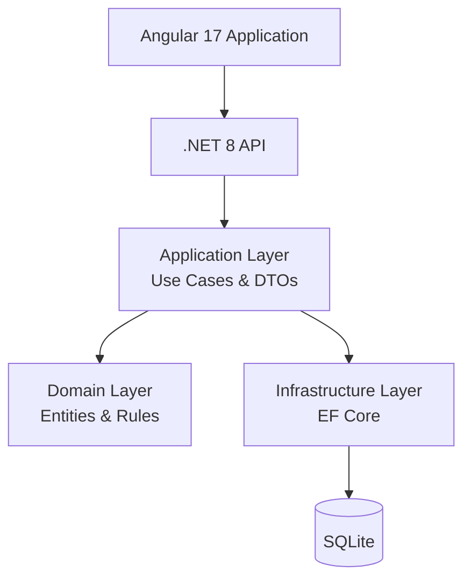
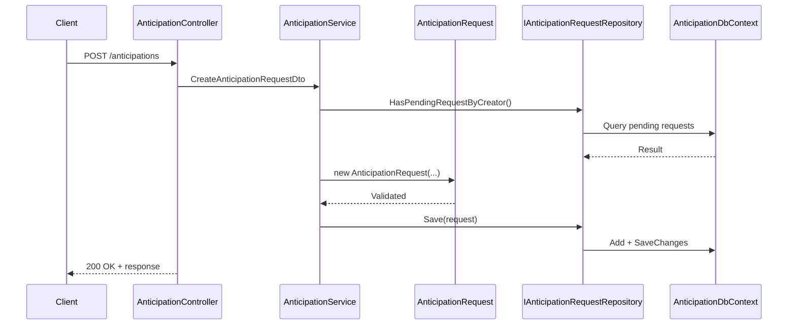

# 📘 LastLink Payment — Detailed Technical Documentation (MVP V1)

This document expands the README with in-depth architecture, domain modeling, testing strategy, and design decisions for the **LastLink Payment – Anticipation Service**.

---

# 🧭 1. Technical Challenge Summary

## 1.1 Functional Requirements
- Create anticipation request
- Apply fixed fee of **5%**
- Validate minimum allowed value (**R$100**)
- One pending request per creator
- Approve or reject an anticipation
- List anticipations by creator
- Optional simulation endpoint (no persistence)

## 1.2 Business Rules

| Rule | Description                                 |
|------|---------------------------------------------|
| R1   | Amount must be ≥ R$100                      |
| R2   | Only one pending request per creator        |
| R3   | Fee is fixed: 5%                            |
| R4   | Initial status must always be `Pending`     |
| R5   | Valid transitions: Pending → Approved/Rejected |

All rules are enforced **exclusively inside the Domain Layer**, following DDD.

---

# 🏛 2. Architecture Overview

The system follows **Clean Architecture + DDD**, ensuring:
- Domain isolation and purity  
- Infrastructure replaceability  
- Testability and maintainability  
- Strict dependency inversion  

---

# 2.1 Clean Architecture Diagram

```mermaid
flowchart TB

    API["API Layer<br/><br/>
    • Controllers/V1/AnticipationController.cs<br/>
    "]:::api

    APP["Application Layer<br/><br/>
    • DTOs<br/>
    • Interfaces<br/>
    • Services<br/>
    "]:::app

    DOMAIN["Domain Layer<br/><br/>
    • Entities<br/>
    • Enums<br/>
    • Exceptions<br/>
    • Repositories<br/>
    "]:::domain

    INFRA["Infrastructure Layer<br/><br/>
    • DbContext<br/>
    • Configurations<br/>
    • Repositories<br/>
    • Migrations<br/>
    "]:::infra

    API --> APP
    APP --> DOMAIN
    APP --> INFRA
    INFRA --> DOMAIN

classDef api fill:#1e90ff22,stroke:#1e90ff,stroke-width:2px;
classDef app fill:#32cd3222,stroke:#32cd32,stroke-width:2px;
classDef domain fill:#ffcc0022,stroke:#ffcc00,stroke-width:2px;
classDef infra fill:#ff634722,stroke:#ff6347,stroke-width:2px;
````

---

# 2.2 C4 — System Context Diagram

```mermaid
flowchart LR
    User([Creator / Internal System]) --> API["Anticipation API (V1)"]
    API --> DB[(SQLite Database)]
    API --> Frontend["Angular 17 Frontend"]
```

---

# 2.3 C4 — Container Diagram



---

# 2.4 Sequence Flow — Create Anticipation Request



---

# 🧠 3. Domain Model (DDD)

## 3.1 Entity: AnticipationRequest

Core attributes:

* `Id`
* `CreatorId`
* `GrossAmount`
* `FeeRate` (always 5%)
* `NetAmount`
* `CreatedAt`
* `DecisionAt`
* `Status`

Encapsulated behaviors:

* Validate minimum value
* Ensure only one pending request exists
* Calculate net amount
* Approve / reject with timestamping

---

## 3.2 Enum: AnticipationStatus

Values:

* `Pending`
* `Approved`
* `Rejected`

---

## 3.3 Exceptions

* `DomainException.cs`
  Used for invariant violations.

---

## 3.4 Repository Abstraction

* `IAnticipationRequestRepository.cs`
  Defines the contract used by Application Layer to persist domain entities.

---

# 🌐 4. API Documentation

## 4.1 Base Route

```
/api/v1/anticipations
```

---

## 4.2 Create Request

### POST

```
/api/v1/anticipations
```

Example Request:

```json
{
  "creatorId": "3fa85f64-5717-4562-b3fc-2c963f66afa6",
  "grossAmount": 500
}
```

Successful Response:

```json
{
  "success": true,
  "anticipationId": "generated-guid"
}
```

---

## 4.3 List by Creator

```
GET /api/v1/anticipations?creatorId={id}
```

---

## 4.4 Approve

```
POST /api/v1/anticipations/{id}/approve
```

---

## 4.5 Reject

```
POST /api/v1/anticipations/{id}/reject
```

---

## 4.6 Simulation (No Persistence)

```
GET /api/v1/anticipations/simulate?creatorId={id}&grossAmount={value}
```

---

# 🧪 5. Testing Strategy (Unit + E2E)

## 5.1 Unit Tests

Frameworks:

* NUnit 4.4
* FluentAssertions
* Moq

Coverage:

* Domain rule enforcement
* Fee calculation
* Net amount calculation
* Status transition validation
* Application service orchestration

Structure:

```
backend/tests/LastLink.Payment.Anticipation.Tests/
```

---

## 5.2 E2E Tests (Postman)

Located at:

```
e2e/postman/
```

Scenarios:

1. Create → List → Approve
2. Reject flow
3. Minimum value rule
4. Pending restriction
5. Simulation only

Each request validates:

* HTTP status
* Response envelope
* Timestamps
* Domain rule compliance

---

# 📊 6. Traceability Matrix (Business Rule → Unit Test → E2E)

| Business Rule    | Unit Test                                   | E2E Scenario |
| ---------------- | ------------------------------------------- | ------------ |
| Minimum Value    | ShouldThrowException_WhenBelowMinimumAmount | Scenario 3   |
| One Pending Only | ShouldPreventMultiplePendingRequests        | Scenario 4   |
| Fee Calculation  | FeeCalculation_ShouldBeFivePercent          | Scenario 1   |
| Approve Flow     | Approve_ShouldUpdateStatusAndTimestamp      | Scenario 1   |
| Reject Flow      | Reject_ShouldUpdateStatusAndTimestamp       | Scenario 2   |
| Simulation       | Simulation_ShouldCalculateCorrectValues     | Scenario 5   |

---

# 🧾 7. Architecture Decision Records (ADR)

## ADR-001 — Clean Architecture

Chosen for maintainability, testability, and long-term scaling.

## ADR-002 — .NET 8 (8.0.416)

Stable, performant, LTS-aligned.

## ADR-003 — SQLite

Zero-configuration, ideal for MVP and deterministic testing.

## ADR-004 — Angular 17

Modern, stable, and compatible with standalone components.

## ADR-005 — API Versioning

V1 now; V2+ will introduce gateways and auth without breaking contracts.

---

# ⚠️ 8. Known Limitations (V1)

* No authentication
* No observability (logs, tracing, metrics)
* No failover or gateway integrations
* Basic UI (functional but not productized)

---

# 🌱 9. Future Enhancements

* Creator scoring model
* Admin dashboard
* Fraud detection heuristics
* Multi-gateway orchestration
* Retry + circuit breaker (V2–V3)
* Redis Stream–based async gateway routing (POC)

---

# 👤 Author

**Michael Jackson Moraes**
Software Engineer – .NET, DDD, Payments, Angular

